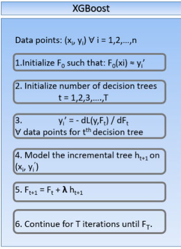

=================================
3. ML-based model
=================================

.. contents:: Table of Contents

Model
==================

As we need to determinate in which category a piece of text belongs, we need either a model capable
to process text or a set of features extracted from it. The base option chosen
it is been the text processing model from the ``fasttext`` python library.

**Fasttext** 

In this model[1], the document vector is obtained by embedding each word in the average of the word divided by its n-grams vector.

Starts with word representations that are averaged into text representation and feed them to a linear classifier (multinomial logistic regression).
Text representation as a hidden state that can be shared among features and classes.
Softmax layer to obtain a probability distribution over pre-defined classes.
Hierarchial Softmax: Based on Huffman Coding Tree Used to reduce computational complexity O(kh) to O(hlog(k)), where k is the number of classes and h is dimension of text representation. In this method, it represents the labels in a binary tree. Every node in the binary tree represents a probability. A label is represented by the probability along the path to that given label. This means that the leaf nodes of the binary tree represent the labels.
Uses a bag of n-grams to maintain efficiency without losing accuracy. No explicit use of word order.
Uses hashing trick to maintain fast and memory efficient mapping of the n-grams.
It is written in C++ and supports multiprocessing during training.

**XGBoost**

On behalf of providing an option that does not require to access the text directly, we have chosen to implement a tuned Extreme Gradient Boost
model which relies on the set of extracted features. 

[1]https://towardsdatascience.com/fasttext-bag-of-tricks-for-efficient-text-classification-513ba9e302e7

Results
===================

When we have to check the quality of our trained model, as a classification one, we relay on the **accuracy**, **recall** and **f1Score** as the main indicators of the model performance. We also took advantatge of
the scikit-learn's ``classification_report``  method, which offers a more detailed view of the classification results, showing the already named metrics for each class.

When it turns out we have no data to compare and we just want to perform predictions with the already trained model, we just obtain
which proportion of data belongs to each category.